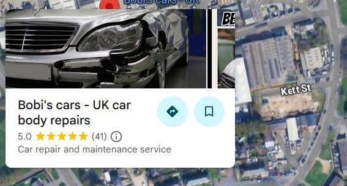
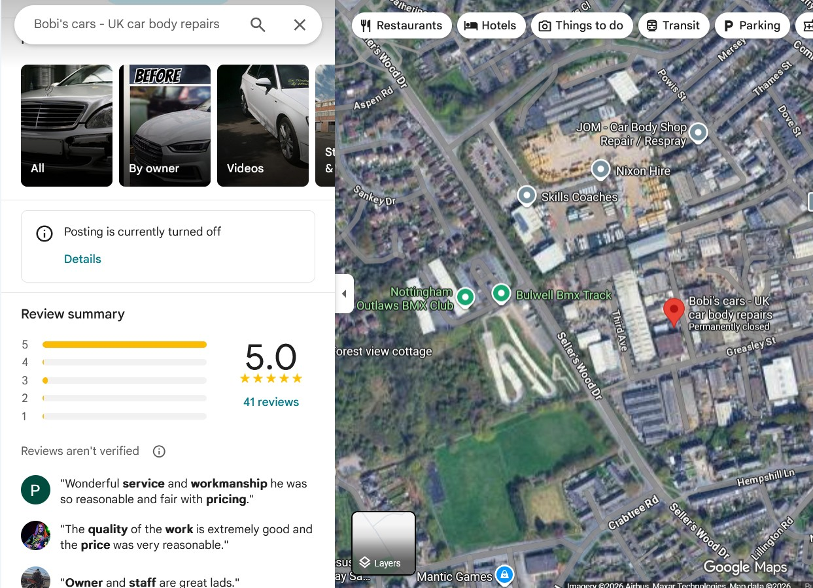
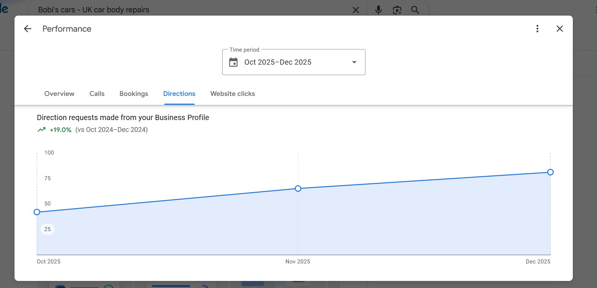
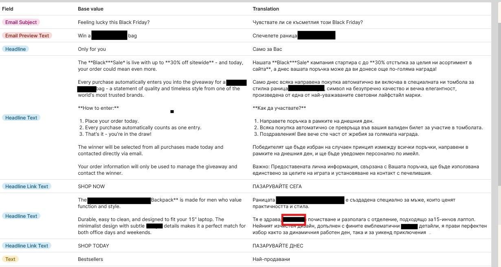

<!DOCTYPE html>
<html lang="en">
<head>
  <meta charset="UTF-8" />
  <meta name="viewport" content="width=device-width, initial-scale=1.0"/>
  <meta name="author" content="Kalina Ivanova"/>
  <title>Kalina Ivanova - SEO Translator & Marketing Specialist (EN-BG)</title>
  <meta name="description" content="Professional English to Bulgarian translator & localization specialist | SEO content, e-commerce emails, Google Maps & review growth, Data Entry & System Accuracy, International Customer Support & Operations | Sofia, Bulgaria">
  
</head>
<body>
<nav>
  

    
Kalina Ivanova

    

      <a href="#services" data-i18n="nav.services">Services</a>
      <a href="#about" data-i18n="nav.about">About</a>
      <a href="#testimonials" data-i18n="nav.testimonials">Testimonials</a>
      <a href="#projects" data-i18n="nav.projects">Projects</a>
      <a href="#experience" data-i18n="nav.experience">Experience</a>
      <a href="#contact" data-i18n="nav.contact">Contact</a>
      
        <button data-lang="en" class="active">EN</button>
        <button data-lang="bg">BG</button>
      
    

  

</nav>

<header id="home">
  

    <h1 data-i18n="hero.name">Kalina Ivanova</h1>
    
SEO Content Translator & Localization Specialist (EN → BG) E-commerce Emails • Google Maps & Review Growth • Data Entry & System Accuracy • International Customer Support & Operations

  

</header>

<section id="services">
  

    <h2 data-i18n="services.title">My Services</h2>
    

      

        <h3 data-i18n="services.trans">EN to BG Translation & Localization</h3>
        
SEO-optimized, culturally adapted content for the Bulgarian market – websites, blogs, product descriptions.

      

      

        <h3 data-i18n="services.emails">E-commerce Marketing Emails</h3>
        
High-converting campaigns: promotions, newsletters, abandoned cart sequences – translated & optimized.

      

      

        <h3 data-i18n="services.wix">Wix Website Building & Optimization</h3>
        
Professional, fast, mobile-friendly Wix sites with basic SEO and content population.

      

      

        <h3 data-i18n="services.maps">Google Maps & Review Management</h3>
        
Business profile optimization, custom links, review strategies to increase ratings & visibility.

      

      

        <h3 data-i18n="services.customer">International customer Support & Operations</h3>
        
Professional e-commerce support: customer enquiries, order processing, returns, refunds, and issue resolution.

      

      

        <h3 data-i18n="services.data">Data Entry & System Accuracy</h3>
        
Accurate entry and maintenance of orders, product data, customer records, and operational information.

      

    

  

</section>

<section id="about">
  

    <h2 data-i18n="about.title">About Me</h2>
    

      
Marketing & Localisation Specialist with 11+ years of experience in customer service, order fulfilment, operations, and direct communication with international clients and teams.

      
Detail-oriented and results-driven, I support brands entering and growing in the Bulgarian market through accurate EN→BG translation, SEO-focused localisation, marketing content, and practical digital solutions (Wix, Google Maps, review strategies).

      
Languages: Bulgarian (Native), English, Italian

      

        <a href="https://www.linkedin.com/in/kalina-ivan-42a8a6143/" target="_blank" rel="noopener noreferrer">LinkedIn</a>
        <a href="https://www.upwork.com/freelancers/~0162981d3b8fac628e?viewMode=1" target="_blank" rel="noopener noreferrer">Upwork</a>
      

    

  

</section>

<section id="testimonials" style="background:#f8f9fa;">
  

    <h2 data-i18n="testimonials.title">Testimonials</h2>
    

      

        
★★★★★

        
“Kalina consistently delivers Bulgarian localisation that reads naturally and aligns with brand tone. Her work is precise, well-structured, and ready to publish.”

        — Marketing Manager, E-commerce
      

      

        
★★★★★

        
“Professional and dependable. Kalina communicates clearly, handles customer cases with confidence, and keeps a calm, solution-focused tone.”

        — Customer Support Lead
      

      

        
★★★★★

        
“Excellent attention to detail. Kalina manages purchase order workflows accurately, documents processes clearly, and follows through reliably on deadlines.”

        — Operations Coordinator
      

    

  

</section>

<section id="projects">
  

    <h2 data-i18n="projects.title">Real Examples & Projects</h2>
    

      

        <h3 data-i18n="projects.wix">Wix Website: Bobi's Cars (UK)</h3>
        
Professional Wix site built for a Nottingham car body repair business – services, contact & clean design.

        
        <a href="https://kalina2005kalina20.wixsite.com/bobicars" class="btn" target="_blank" rel="noopener noreferrer">View Live Site</a>
      

      

        <h3 data-i18n="projects.maps">Google Maps & Review Growth: Bobi's Cars</h3>
        
Optimized Google Business Profile + review strategy – increased visibility and ratings.

        
        
      

      

        <h3 data-i18n="projects.trans">Translation Example: EN → BG</h3>
        
Sample from current e-commerce/marketing project – natural, SEO-friendly localization.

        
        
      

    

  

</section>

<section id="experience">
  

    <h2 data-i18n="experience.title">Professional Experience</h2>
    

      

        <h3 data-i18n="experience.freelance">Freelance SEO Marketing Translator & Localisation Specialist</h3>
        EU-based E-commerce Projects | Remote – Sofia, Bulgaria
        <ul>
          <li data-i18n="experience.freelance_li1">Led SEO-driven localisation for product, category, and campaign content in the Bulgarian market</li>
          <li data-i18n="experience.freelance_li2">Defined keyword strategy and search intent alignment to improve search visibility and performance</li>
          <li data-i18n="experience.freelance_li3">Optimised content for brand consistency, linguistic accuracy, and conversion</li>
          <li data-i18n="experience.freelance_li4">Partnered with global marketing teams to deliver localised campaigns on time</li>
        </ul>
      

      

        <h3 data-i18n="experience.amazon">Customer Operations Specialist</h3>
        Amazon Fulfilment Centre, UK • Feb 2020 – Jul 2025
        <ul>
          <li data-i18n="experience.amazon_li1">Managed inbound operations and inventory discrepancies</li>
          <li data-i18n="experience.amazon_li2">Resolved customer claims related to deliveries, damages, and order discrepancies</li>
          <li data-i18n="experience.amazon_li3">Analysed data and drove process improvements</li>
          <li data-i18n="experience.amazon_li4">Investigated system vs. physical stock variances to support loss prevention</li>
        </ul>
      

    

  

</section>

<section id="contact" style="background:var(--primary); color:white;">
  

    <h2 data-i18n="contact.title">Get In Touch</h2>
    

      

        Want to discuss a project or have a question? 
        Click the button below
      

      
      <a href="mailto:kivanova.mail@gmail.com?subject=Запитване%20от%20сайта&body=Здравейте%20Калина%2C%0D%0A%0D%0AИме%3A%20%0D%0AИмейл%3A%20%0D%0A%0D%0AСъобщение%3A%20%0D%0A%0D%0AБлагодаря!" class="btn" data-i18n="contact.button">
        Изпрати съобщение
      </a>
      
      

        or directly to: 
        <a href="mailto:kivanova.mail@gmail.com" style="color:#dbeafe; text-decoration:underline;">kivanova.mail@gmail.com</a>
      

    

  

</section>

<footer>
  
© 2026 Kalina Ivanova. All rights reserved. | Freelance Translator & Marketing Specialist – Sofia, Bulgaria

</footer>

</body>
</html>
